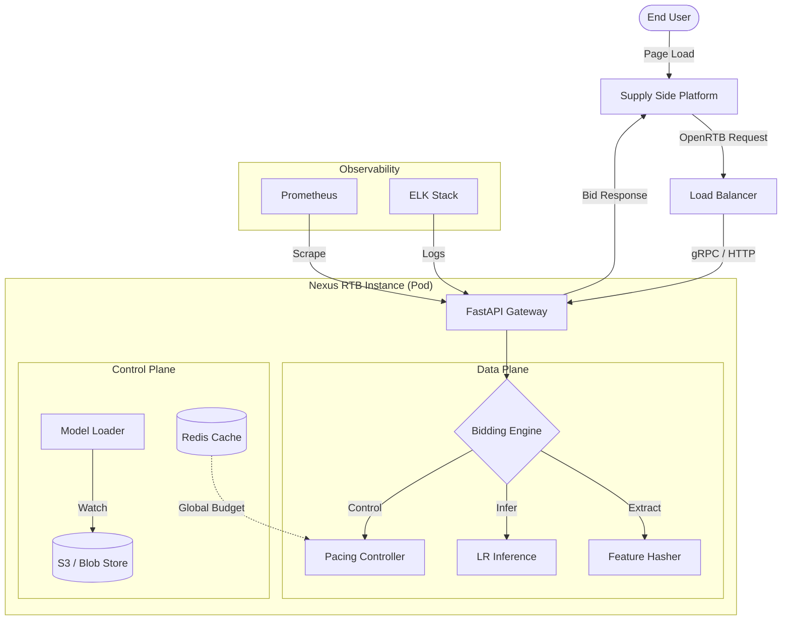

# System Architecture

## 1. High-Level Design

Nexus-RTB implements a **Service-Oriented Architecture (SOA)** tailored for low-latency, high-throughput soft-real-time constraints. It is designed to be deployed as a sidecar to an Envoy proxy or as a standalone Kubernetes service.

### Component Diagram

---

## 2. Core Components

### 2.1 Bidding Engine (`src.bidding.engine`)

The distinct orchestration layer that strictly separates I/O from compute.

- **Input**: `BidRequest` (Pydantic Model)
- **Output**: `BidResponse`
- **SLA**: 5ms timeout.

### 2.2 Feature Engineering (`src.bidding.features`)

Implements the **hashing trick** to ensure constant memory complexity $O(1)$ regardless of dictionary size.

- **Hash Space**: $2^{18}$ (262,144) buckets.
- **Collision Policy**: Ignored (assumed random noise cancels out at scale).

### 2.3 Pacing Controller (`src.bidding.pacing`)

A local implementation of a **PID Controller** that regulates spend velocity.

- **Proportional (P)**: Reacts to immediate overspend.
- **Integral (I)**: Corrects long-term drift.
- **Derivative (D)**: Dampens oscillation.
- **Distributed Mode**: Periodically syncs with Redis (Token Bucket algorithm) to allocate global budget slices.

---

## 3. Data Flow

1.  **Request Ingestion**: FastAPI receives JSON payload.
2.  **Validation**: Schema validation via Pydantic (fail-fast).
3.  **Feature Extraction**: Raw strings (UA, URL) are hashed into sparse indices.
4.  **Inference**:
    - $pCTR = \sigma(\mathbf{w}_{ctr} \cdot \mathbf{x} + b_{ctr})$
    - $pCVR = \sigma(\mathbf{w}_{cvr} \cdot \mathbf{x} + b_{cvr})$
5.  **Valuation**: $Bid = pCTR \times pCVR \times Value \times Pacing$.
6.  **Response**: JSON serialized and returned.

---

## 4. Scalability & Resilience

### 4.1 Horizontal Scaling

The engine is stateless. Scale out is achieved by adding replicas behind a Layer 7 Load Balancer.

- **Throughput**: Linear scaling with CPU cores.
- **State**: No local state persistence (Model is read-only).

### 4.2 Failure Modes

| Failure Scenario  | Mitigation                  | Result                                 |
| ----------------- | --------------------------- | -------------------------------------- |
| **Redis Down**    | Fallback to Local Pacing    | Safe, potentially conservative spend.  |
| **Model Corrupt** | Signature Verification Fail | Engine refuses to start (Fail-Closed). |
| **High Latency**  | Time Budget Check           | Drop request if processing > 4ms.      |
| **Memory Spike**  | Hard Limit (512MB)          | Container restart (OOM Killer).        |

---

## 5. Security Architecture

### 5.1 Threat Model

- **Malicious Payload**: Prevented by strict type validation and string truncation.
- **Model Tampering**: Prevented by `SHA256` detached signatures on `model_weights.pkl`.
- **Replay Attacks**: `bidId` deduplication (if using Redis) or short TTL.

### 5.2 Supply Chain Security

- **Dependencies**: Pinned versions in `requirements.txt`.
- **Image**: Minimal `python:3.11-slim` base image.
- **Secrets**: Injected via Environment Variables, never committed.
