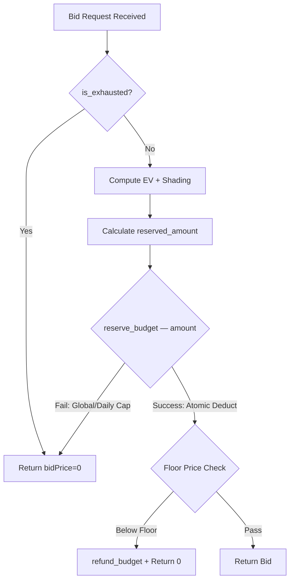
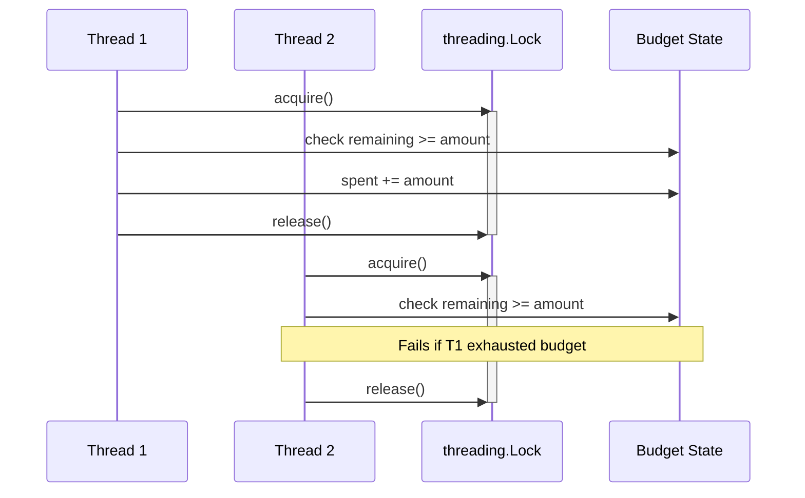
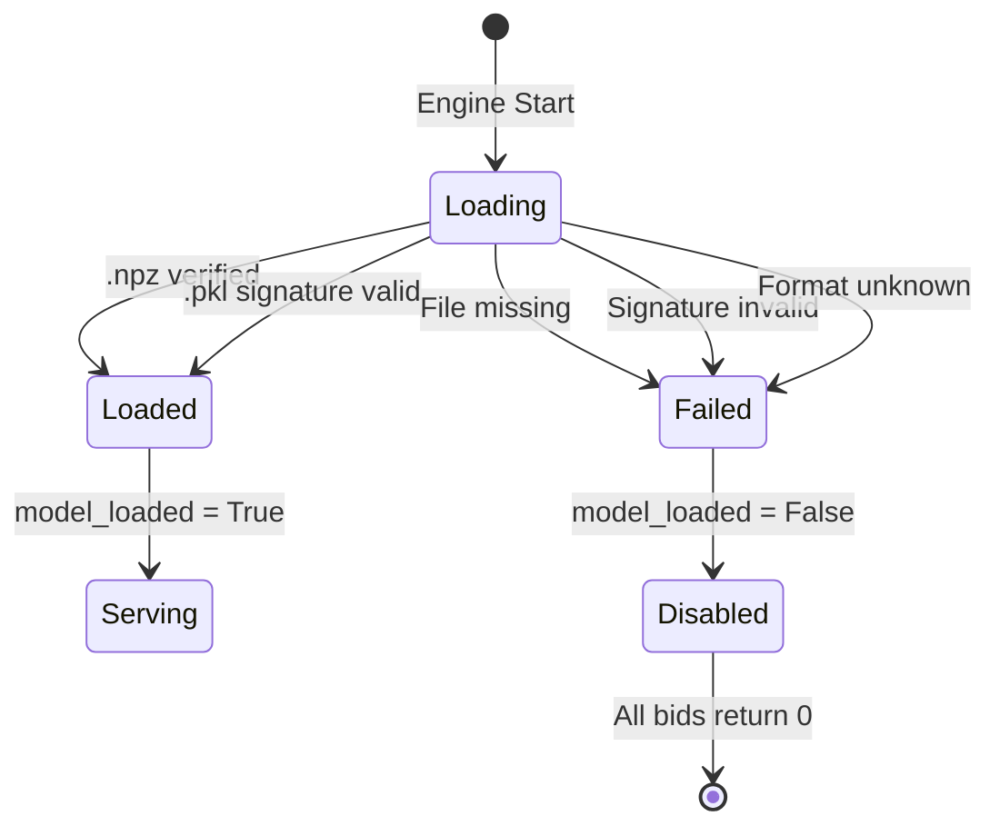
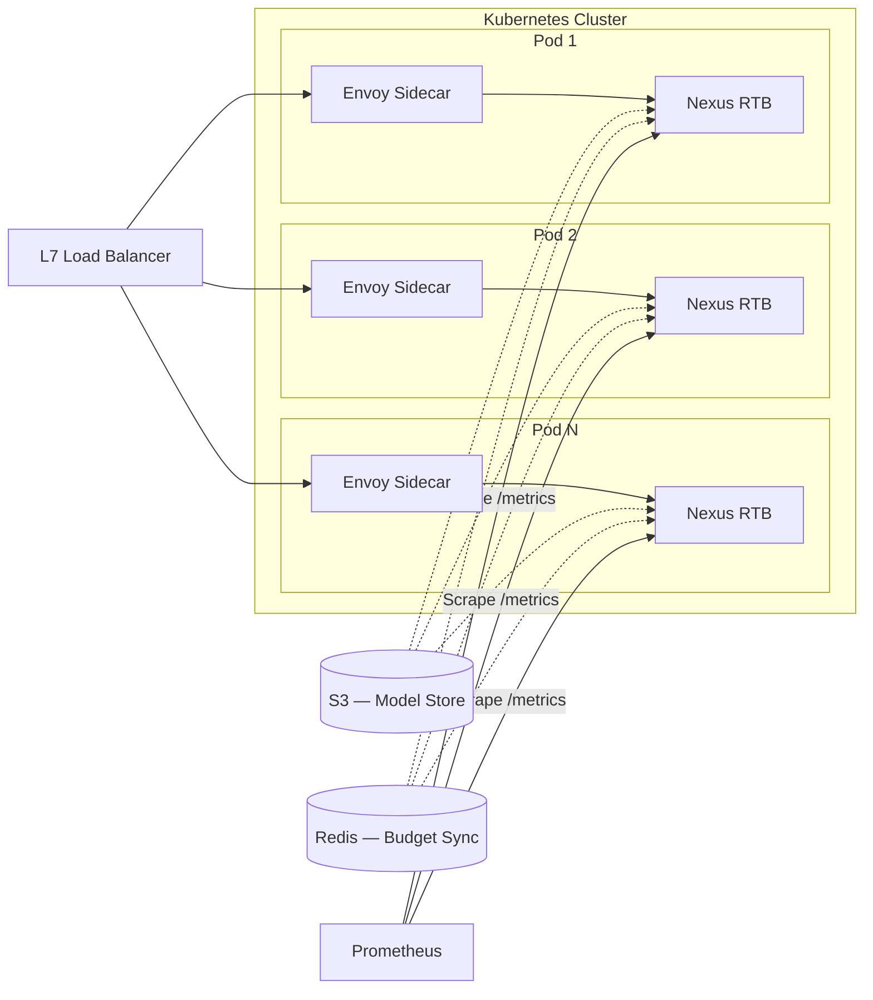

# System Architecture

## 1. High-Level Design

Nexus-RTB implements a **Service-Oriented Architecture (SOA)** tailored for low-latency, high-throughput soft-real-time constraints. It is designed to be deployed as a sidecar to an Envoy proxy or as a standalone Kubernetes service.

### Component Diagram

---

## 2. Core Components

### 2.1 Bidding Engine (`src.bidding.engine`)

The orchestration layer that strictly separates I/O from compute.

- **Input**: `BidRequest` (Pydantic Model)
- **Output**: `BidResponse`
- **SLA**: 5ms timeout

### 2.2 Feature Engineering (`src.bidding.features`)

Implements the **hashing trick** to ensure constant memory complexity $O(1)$ regardless of dictionary size.

- **Hash Space**: $2^{18}$ (262,144) buckets
- **Collision Policy**: Ignored (random noise cancels at scale)

### 2.3 Pacing Controller (`src.bidding.pacing`)

A local **PID Controller** that regulates spend velocity.

- **Proportional (P)**: Reacts to immediate overspend
- **Integral (I)**: Corrects long-term drift
- **Derivative (D)**: Dampens oscillation
- **Distributed Mode**: Periodically syncs with Redis (Token Bucket) for global budget slices

---

## 3. Budget Control Flow

The budget system strictly separates **Hard Caps** (financial safety) from **Soft Caps** (traffic smoothing).

### Cap Hierarchy

| Layer        | Type | Enforcement        | Blocks Reservation? |
| ------------ | ---- | ------------------ | ------------------- |
| Global Total | HARD | `reserve_budget()` | ✅ Yes              |
| Daily Spend  | HARD | `reserve_budget()` | ✅ Yes              |
| Hourly Spend | SOFT | PID shading        | ❌ No               |
| Minute Spend | SOFT | PID shading        | ❌ No               |

---

## 4. Concurrency Model

All financial state in `PacingController` is protected by `threading.Lock`.

### Thread Safety Guarantees

- **Atomic reservation**: Check + deduct in single locked section
- **Atomic refund**: Add-back in single locked section
- **No TOCTOU**: `can_bid()` + `record_bid()` pattern eliminated
- **Verified**: 32-thread stress test with zero overspend

---

## 5. Model Lifecycle

### Fail-Closed Behavior

| Scenario                  | `model_loaded` | Engine Action       |
| ------------------------- | -------------- | ------------------- |
| `.npz` loads successfully | `True`         | Normal bidding      |
| `.pkl` with valid SHA256  | `True`         | Normal bidding      |
| File not found            | `False`        | Return `bidPrice=0` |
| Invalid signature         | `False`        | Return `bidPrice=0` |
| Unknown format            | `False`        | Return `bidPrice=0` |
| Exception during load     | `False`        | Return `bidPrice=0` |

---

## 6. Deployment Architecture

### Scaling Properties

| Property        | Value                          |
| --------------- | ------------------------------ |
| **State**       | Stateless (model is read-only) |
| **Scaling**     | Horizontal — add replicas      |
| **Throughput**  | Linear with CPU cores          |
| **Budget Sync** | Redis Token Bucket (periodic)  |
| **Model Sync**  | S3 watcher (pull-based)        |

---

## 7. Data Flow

1. **Request Ingestion**: FastAPI receives JSON payload
2. **Validation**: Schema validation via Pydantic (fail-fast)
3. **Exhaustion Check**: `is_exhausted()` — immediate reject if budget gone
4. **Feature Extraction**: Raw strings (UA, URL) hashed into sparse indices
5. **Inference**: $pCTR = \sigma(\mathbf{w}_{ctr} \cdot \mathbf{x} + b_{ctr})$, $pCVR = \sigma(\mathbf{w}_{cvr} \cdot \mathbf{x} + b_{cvr})$
6. **Valuation**: $Bid = pCTR \times pCVR \times Value \times Shading \times \alpha$
7. **ROI Guard**: Reject if `custom_score * avg_mp < EV`
8. **Atomic Reservation**: `reserve_budget(amount)` — blocks if hard cap exceeded
9. **Floor Check**: Refund if bid < floor price
10. **Response**: JSON serialized and returned

---

## 8. Failure Modes

| Failure Scenario  | Mitigation                  | Result                             |
| ----------------- | --------------------------- | ---------------------------------- |
| **Redis Down**    | Fallback to local pacing    | Safe, conservative spend           |
| **Model Corrupt** | Signature verification fail | Engine disabled (fail-closed)      |
| **High Latency**  | Time budget check           | Drop request if processing > 4ms   |
| **Memory Spike**  | Hard limit (512MB)          | Container restart (OOM Killer)     |
| **Budget Race**   | `threading.Lock`            | Atomic reservation, zero overspend |

---

## 9. Security Architecture

### Threat Model

- **Malicious Payload**: Prevented by strict type validation and string truncation
- **Model Tampering**: Prevented by `SHA256` detached signatures on model files
- **Replay Attacks**: `bidId` deduplication (if using Redis) or short TTL
- **SQL Injection**: Parameterized queries with table name allowlist

### Supply Chain Security

- **Dependencies**: Pinned versions in `requirements.txt`
- **Image**: Minimal `python:3.9-slim` base image
- **Secrets**: Injected via Environment Variables, never committed
