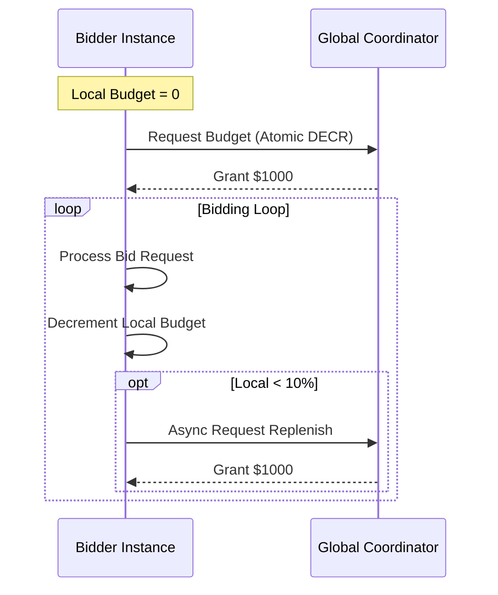

# Distributed Budget Coordination Design

## Problem

In a distributed DSP, thousands of bidder instances bid concurrently. If each instance is unaware of the others, they might collectively overspend the daily budget significantly before the system reacts.

## Architecture

### 1. Global Coordinator (Redis / Parameter Server)

- Maintains the **Authority Verification** of the remaining budget.
- Operations are **Atomic** (Decrements).

### 2. Local Agents (Bidder Instances)

- Request **Budget Leases** (e.g., $1,000 chunks).
- Bid locally until the lease is exhausted.
- Asynchronously request a new lease when local buffer is low (<10%).

## Interaction Diagram

## Protocol

1. **Initialize**: Bidder starts with local_budget = 0.
2. **Request**: `GRANT = ATOMIC_DECR(GLOBAL_BUDGET, CHUNK_SIZE)`
3. **Spend**: Bidder spends from local buffer.
4. **Replenish**: If local < Threshold, GOTO 2.
5. **Stop**: If GRANT == 0, stop bidding or switch to Pacing Mode (Probe).

## Consistency Guarantees

- **Safety**: Total Valid Spend <= Total Budget + (N_Instances \* Avg_Bid).
- **Liveness**: As long as Global > 0, some instance will get budget.
- **Fairness**: Depends on request rate; heavily loaded instances naturally pull more budget (Leaky Bucket).

## Simulation Results

See `SIMULATION_REPORT.md` for results of the Mock Distributed Test.
