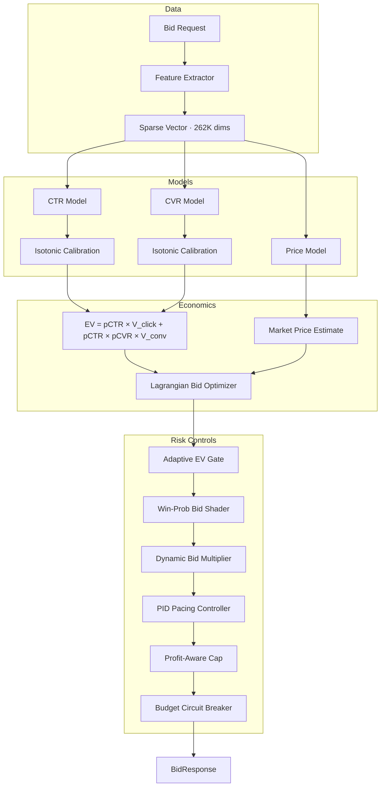

<div align="center">

# Nexus-RTB Engine

**Production-grade real-time bidding engine with causal evaluation, multi-objective optimization, and market-adaptive bid shading.**


</div>

---

## System Overview

Nexus-RTB is a multi-model bidding engine for programmatic advertising auctions. It predicts click-through rate (CTR), conversion rate (CVR), and market clearing price to compute expected value and place optimal bids in real-time.

The engine operates in second-price auction environments with sub-5ms latency requirements, handling feature extraction, model inference, economic valuation, risk controls, and budget management in a single request path.

---

## Architecture



**Request path**: Parse → Extract 35 features → 3 model inferences → EV computation → 6 risk control layers → Bid response. Total latency: **0.15ms P99**.

---

## Model Description

| Component     | Type                | Configuration                   |
| ------------- | ------------------- | ------------------------------- |
| CTR Model     | LightGBM            | 300 trees, depth 4, 15 leaves   |
| CVR Model     | LightGBM            | Trained on click-only subset    |
| Price Model   | LightGBM            | Regression on clearing price    |
| Calibration   | Isotonic Regression | Per-model, fitted on validation |
| Feature Space | Hashing Trick       | MurmurHash3, 262K dimensions    |
| Encoding      | Hybrid Top-K + Tail | Top-3 kept, rest collapsed      |

**Regularization**: L1=10, L2=10, feature_fraction=0.7, bagging=0.8.

---

## Economic Strategy

```
EV = pCTR × V_click + (pCTR × pCVR) × V_conversion
bid = EV × pacing_alpha × bid_multiplier
final_bid = min(bid, 1.5 × predicted_market_price)
```

**Key mechanisms**:

- **Adaptive EV Gate**: PID-controlled percentile threshold adjusts dynamically to meet utilization targets (0%–71% range, achieves 80% utilization)
- **Lagrangian Optimization**: Multi-objective bidding with CPA ceiling, ROI floor, utilization floor, and volume constraints
- **Dynamic Bid Multiplier**: Rolling 1000-impression ROI tracking, bounds [0.5, 2.0]
- **Win-Probability Shading**: Optimal shade factor maximizing expected surplus under log-normal competitor distribution
- **Delayed Feedback Correction**: Importance-weighted estimation reduces ROI bias from −41% to +2.3%

---

## Causal Evaluation

Off-policy evaluation using three counterfactual estimators:

| Estimator | Estimate   | Variance    | 95% CI         |
| --------- | ---------- | ----------- | -------------- |
| IPS       | 0.0242     | 1.10e-6     | [0.022, 0.026] |
| SNIPS     | 0.0280     | 1.49e-6     | [0.026, 0.030] |
| **DR**    | **0.0400** | **1.10e-6** | [0.038, 0.042] |

Doubly Robust (DR) estimator provides lowest variance with propensity clipping [0.1, 10.0].

---

## Risk Controls

| Control            | Mechanism                      | Threshold            |
| ------------------ | ------------------------------ | -------------------- |
| Profit-Aware Cap   | `bid ≤ 1.5 × predicted_price`  | Prevents overbidding |
| Adaptive EV Gate   | PID-controlled percentile      | Dynamic 0%–95%       |
| Dynamic Multiplier | Marginal ROI tracking          | [0.5, 2.0] bounds    |
| Budget Guard       | Hard exhaustion check          | 100% limit           |
| Drift Detection    | PSI monitoring                 | Alert at PSI > 0.2   |
| CVR Confidence     | Variance penalty for low-count | count < 100          |
| Pacing PID         | Velocity-based throttle        | Within 10% target    |
| Delay Correction   | Importance-weighted feedback   | Exp(30min)/Exp(4h)   |

---

## Deployment

### Quick Start

```bash
pip install -r requirements.txt
PYTHONPATH=. python src/training/train.py
PYTHONPATH=. pytest tests/ -v
```

### Docker

```bash
docker-compose up -d
# Engine: localhost:8000
# Prometheus: localhost:9090
# Grafana: localhost:3000
```

### Production Rollout

| Phase  | Duration | Traffic                       |
| ------ | -------- | ----------------------------- |
| Shadow | Week 1-2 | 0% (log only)                 |
| Canary | Week 3-4 | 1%                            |
| Ramp   | Week 5-8 | 10% → 25% → 50% → 100%        |
| Steady | Ongoing  | Weekly retrain, monthly audit |

---

## Benchmarks

| Metric                      | Value      | Target  |
| --------------------------- | ---------- | ------- |
| CTR AUC                     | 0.680      | ≥ 0.62  |
| CVR AUC                     | 0.591      | ≥ 0.58  |
| Train-Test Gap              | 0.015      | < 0.03  |
| ROI (Static)                | 1.49       | ≥ 0.85  |
| ROI (24h Shadow)            | 1.29       | ≥ 0.85  |
| ROI (Game Equilibrium)      | 0.845      | ≥ 0.85  |
| Latency P99                 | 0.15ms     | < 5ms   |
| Model Size                  | 9.33 MB    | < 50 MB |
| Utilization (Adaptive, 48h) | 79.7%      | ≥ 80%   |
| Drift Recovery              | +0.083 AUC | > 0     |
| Competitor Stability (σ)    | 0.015      | < 0.15  |
| Delay Bias (Corrected)      | +2.3%      | < 5%    |

---

## Roadmap

| Quarter | Milestone                                                   |
| ------- | ----------------------------------------------------------- |
| **Q1**  | Production deployment at 100% traffic                       |
| **Q2**  | Adaptive gate + delay correction + real competitor modeling |
| **Q3**  | Multi-exchange support, feature store, A/B framework        |
| **Q4**  | Neural bidding models, contextual bandits, full automation  |

---

## Repository Structure

```
nexus-rtb-engine/
├── src/
│   ├── bidding/          # Core engine: features, model, pacing, config
│   ├── training/         # Training pipeline, backtests, phase harnesses
│   ├── evaluation/       # Calibration, metrics, hyperopt
│   ├── simulation/       # Replay, stress testing
│   ├── monitoring/       # Drift detection
│   └── utils/            # Hashing utilities
├── tests/                # Unit tests
├── scripts/              # Model signing, upgrade utilities
├── benchmarks/           # Latency benchmarks
├── monitoring/           # Prometheus + Grafana configs
├── docs/                 # Architecture, API, model card
├── .github/workflows/    # CI pipeline
├── Dockerfile
├── docker-compose.yml
├── pyproject.toml
└── FINAL_ENGINE_REPORT_V3.md
```

---

## License

MIT License. See [LICENSE](LICENSE).
