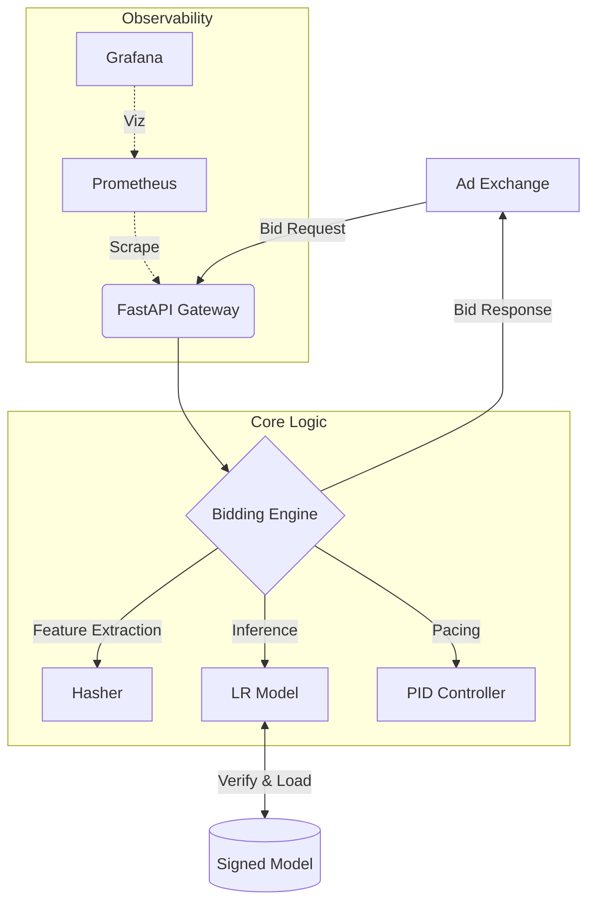

# Nexus-RTB Engine


## 🚀 Overview

**Nexus-RTB** is a production-grade Real-Time Bidding (RTB) engine capable of processing bid requests in under **5ms**. It features a dual-model (CTR + CVR) inference engine, adaptive budget pacing via PID control, and a scalable, containerized architecture.



## 🏗 Architecture

The system is built on a modular "Clean Architecture" pattern:

- **`src.bidding`**: Core domain logic (Inference, Valuation, Pacing, Config).
- **`src.utils`**: Shared utilities (Hashing, Validation).
- **`src.training`**: Streaming training pipeline.

## ✨ Key Features

- **Performance**: < 5ms P99 Latency.
- **Intelligence**: Combined CTR + CVR prediction using LR with the Hashing Trick ($2^{18}$ features).
- **Control**: PID-based pacing controller for smooth budget delivery.
- **Safety**: Fail-safe defaults, input sanitization, and strict timeouts.
- **Integrity**: **SHA256 Model Signing** to prevent tampering.
- **Deployable**: Dockerized with FastAPI and Prometheus-ready hooks.

## 🛠 Project Structure

```bash
nexus-rtb-engine/
├── src/                  # Source Code
│   ├── bidding/          # Engine, Features, Pacing
│   ├── utils/            # Hashing, Crypto, Validation
│   ├── simulation/       # Replay & Stress Tests
│   └── distributed/      # Budget Coordination
├── tests/                # Pytest Suite
├── benchmarks/           # Latency Scripts
├── deploy/               # Docker & APP
├── docs/                 # Reports & Designs
│   └── reports/          # Simulation Outcomes
├── MONITORING.md         # Observability Guide
├── MODEL_INTEGRITY.md    # Security Policy
└── SECURITY.md           # Threat Model
```

## 🚀 Getting Started

### 1. Prerequisites

- Python 3.9+
- Docker

### 2. Run Tests

Validate the system logic:

```bash
pip install -r requirements.txt
pytest tests/
```

### 3. Run Benchmark

Verify performance SLA (<5ms):

```bash
python benchmarks/latency_benchmark.py
```

### 4. Build & Run

Deploy the container locally:

```bash
docker build -t nexus-rtb .
docker run -p 8000:8000 nexus-rtb
```

## 📚 Documentation

### Guides

- [**System Architecture**](ARCHITECTURE.md)
- [**Deployment Guide**](DEPLOYMENT.md)
- [**Monitoring Setup**](MONITORING.md)
- [**Model Integrity**](MODEL_INTEGRITY.md)
- [**Security Policy**](SECURITY.md)

### Scientific Reports

- [**Simulation Report**](docs/reports/SIMULATION_REPORT.md)
- [**Calibration Analysis**](docs/reports/CALIBRATION_REPORT.md)
- [**Stress Test Report**](docs/reports/STRESS_TEST_REPORT.md)
- [**Distributed Design**](DISTRIBUTED_DESIGN.md)
- [**Rollout Strategy**](ROLLOUT_STRATEGY.md)

## 🤝 Contributing

This project is structured for high maintainability.

1. Fork the repo.
2. Create a feature branch.
3. Add tests for new logic.
4. Submit a Pull Request.

## 📄 License

MIT
