<p align="center">
  <h1 align="center">⚡ Nexus-RTB Engine</h1>
  <p align="center">
    <strong>High-Performance Real-Time Bidding Engine with Economic Safety Guarantees</strong>
  </p>
</p>

<p align="center">
  <a href="https://github.com/Rexy-5097/nexus-rtb-engine/actions"></a>
  <a href="#"></a>
  <a href="#"></a>
  <a href="LICENSE"></a>
  <a href="SECURITY.md"></a>
  <a href="#"></a>
</p>

---

**Nexus-RTB** is a production-grade Real-Time Bidding engine designed for microsecond-latency ad auctions. It implements advanced economic safety mechanisms — including Expected Value (EV) bidding, PID-based pacing control, atomic budget reservation, and hard budget enforcement — making it suitable for distributed production environments.

> **Production Note**: This repository represents a reference implementation of a sidecar bidding agent compatible with OpenRTB 2.5 standards.

---

## 🏗 System Architecture

The engine follows a **Clean Architecture** pattern, strictly separating I/O (FastAPI) from core bidding logic. It is designed to run as a stateless container (Kubernetes Pod) with a sidecar architecture.

```mermaid
graph TD
    User([ SSP / Ad Exchange ]) -->|OpenRTB Request| API[FastAPI Gateway]

    subgraph "Core Engine — Stateless"
        API -->|Validate| Schema[Pydantic Schema]
        Schema -->|Extract| Feat[Feature Hashing — Murmur3/Adler32]
        Feat -->|Infer| Model[Logistic Regression — Sparse]

        Model -->|pCTR / pCVR| Valuation{Valuation Logic}
        Valuation -->|EV Calculation| Pacer[PID Pacing Controller]

        Pacer -.-|Feedback Loop| Budget[Budget State — Thread-Safe]
    end

    Pacer -->|Bid Price| API
    API -->|Bid Response| User
```



---

## 💰 Economic Safety & Bidding Logic

Nexus-RTB prioritizes **financial safety** and **economic rationality** over raw volume.

### 1. Expected Value (EV) Bidding

We use a dual-prediction model to estimate the unified value of an impression:

$$
Bid = \alpha \cdot (pCTR \cdot V_{click} + pCVR \cdot V_{conv})
$$

Where:

- $pCTR$: Probability of Click (Logistic Regression)
- $pCVR$: Probability of Conversion conditional on Click
- $\alpha$: Dynamic pacing factor (Bid Shading) controlled by the PID loop
- $V_{click} / V_{conv}$: Configured base values

### 2. PID Pacing Controller

To prevent budget exhaustion and dampen market shocks, we use a closed-loop **PID Controller**:

- **Proportional (P)**: Reacts to immediate spend velocity divergence.
- **Integral (I)**: Corrects long-term under/over-delivery.
- **Derivative (D)**: Dampens sudden spikes in market price (e.g., 2x shock).

### 3. Hard Budget Enforcement

The engine implements **atomic budget reservation** to guarantee financial compliance:

| Cap Type             | Limit        | Enforcement                              |
| -------------------- | ------------ | ---------------------------------------- |
| **Global Hard Cap**  | \$25,000,000 | `reserve_budget()` — atomic check+deduct |
| **Daily Hard Cap**   | \$25,000,000 | `reserve_budget()` — blocks if exceeded  |
| **Hourly Soft Cap**  | \$2,000,000  | PID shading — traffic smoothing only     |
| **Surge Protection** | \$50,000/min | PID shading — dampens bots/DDoS          |

> **Key Invariant**: `is_exhausted()` returns `True` when `remaining_budget <= 0`. The engine **never** bids after hard exhaustion. Soft caps influence bid magnitude but cannot block a financially valid reservation.

---

## 🛡 Economic Safety Guarantees

| Guarantee                 | Mechanism                                       | Status      |
| ------------------------- | ----------------------------------------------- | ----------- |
| **Zero Overspend**        | Atomic `reserve_budget()` with `threading.Lock` | ✅ Verified |
| **Fail-Closed Model**     | `model_loaded` flag; `bid=0` on load failure    | ✅ Verified |
| **Bid Shading**           | `min(1.0, target_win_rate / observed)`          | ✅ Active   |
| **ROI Guard**             | Reject bid if `custom_score * avg_mp < EV`      | ✅ Active   |
| **Thread Safety**         | All financial state behind `threading.Lock`     | ✅ Verified |
| **Post-Exhaustion Block** | `is_exhausted()` check at top of `process()`    | ✅ Verified |

---

## 🔒 Security & Reliability

| Feature             | Implementation                          | Benefit                                  |
| ------------------- | --------------------------------------- | ---------------------------------------- |
| **Fail-Closed**     | `try-except` returns `bidPrice=0`       | Prevents zombie bidding on error         |
| **Model Integrity** | `SHA256` signature verification         | Prevents tampered model artifacts        |
| **Safe Loading**    | `numpy.load(allow_pickle=False)`        | Mitigates RCE via pickle deserialization |
| **ROI Guard**       | `if predicted_CPA > max_cpa: bid=0`     | Blocks low-quality inventory             |
| **SQL Injection**   | Parameterized queries + table allowlist | Prevents injection in training pipeline  |

---

## 🚀 Performance Benchmarks

Benchmarks run on `c5.2xlarge` (8 vCPU, 16GB RAM):

| Metric          | Result     | Target       | Status |
| --------------- | ---------- | ------------ | ------ |
| **Avg Latency** | 1.2 ms     | < 5 ms       | ✅     |
| **P99 Latency** | 3.8 ms     | < 10 ms      | ✅     |
| **Throughput**  | 12,000 QPS | > 10,000 QPS | ✅     |
| **Memory**      | 140 MB     | < 512 MB     | ✅     |

### Concurrency Stress Test

| Test                | Threads | Budget  | Reservations       | Overspend  |
| ------------------- | ------- | ------- | ------------------ | ---------- |
| Atomic reservation  | 32      | \$1,000 | 10 of 32 succeeded | **\$0.00** |
| Hard exhaustion     | 1       | \$100   | 1 (then blocked)   | **\$0.00** |
| Post-exhaustion bid | 1       | \$0     | Engine returns 0   | ✅         |

---

## 📡 API Reference

### Health Check

```bash
curl -s http://localhost:8000/health
```

```json
{ "status": "healthy", "service": "nexus-rtb" }
```

### Submit Bid Request

```bash
curl -X POST http://localhost:8000/bid \
  -H "Content-Type: application/json" \
  -d '{
    "bidId": "12345",
    "timestamp": "1418818930",
    "visitorId": "abc123",
    "userAgent": "Mozilla/5.0",
    "ipAddress": "192.168.1.1",
    "region": "1",
    "city": "10",
    "adExchange": "1",
    "domain": "example.com",
    "url": "https://example.com/page",
    "anonymousURLID": "anon1",
    "adSlotID": "slot1",
    "adSlotWidth": "300",
    "adSlotHeight": "250",
    "adSlotVisibility": "1",
    "adSlotFormat": "1",
    "adSlotFloorPrice": "50",
    "creativeID": "creative1",
    "advertiserId": "123",
    "userTags": "sports,tech"
  }'
```

```json
{
  "bidId": "12345",
  "bidPrice": 127,
  "advertiserId": "123",
  "explanation": "ok_lat=1.234ms"
}
```

### Prometheus Metrics

```bash
curl -s http://localhost:8000/metrics
```

### OpenAPI Documentation

Interactive Swagger UI available at: `http://localhost:8000/docs`

---

## 🛠 Deployment

### Local Development

```bash
# Install dependencies
pip install -r requirements.txt

# Run tests
pytest tests/ -v

# Start service
uvicorn deploy.app:app --host 0.0.0.0 --port 8000
```

### Docker Production

```bash
docker build -t nexus-rtb:v2.0.0 .
docker run -p 8000:8000 --env-file .env.prod nexus-rtb:v2.0.0
```

---

## 📦 Versioning Strategy

We follow [Semantic Versioning 2.0.0](https://semver.org/):

- **Major (v2.0.0)**: New Bidding Logic (EV), Safety Overhaul, Breaking Config Changes.
- **Minor (v1.1.0)**: New Features (e.g., new model features), Backward Compatible.
- **Patch (v1.0.1)**: Bug Fixes, Doc Updates.

---

## ⚠️ Risk Mitigation

| Risk             | Mitigation                                                                          |
| ---------------- | ----------------------------------------------------------------------------------- |
| **Cold Start**   | PID starts with conservative $\alpha = 0.1$, ramps up gradually                     |
| **Market Shock** | Derivative (D) term aggressively reduces bids on 2x price spikes                    |
| **Model Drift**  | Offline calibration monitoring (see [CALIBRATION_REPORT.md](CALIBRATION_REPORT.md)) |
| **Budget Drain** | `is_exhausted()` hard stop + atomic `reserve_budget()`                              |

---

## 📚 Documentation

| Document                                       | Purpose                                 |
| ---------------------------------------------- | --------------------------------------- |
| [ARCHITECTURE.md](ARCHITECTURE.md)             | System design, data flow, failure modes |
| [SECURITY.md](SECURITY.md)                     | Threat model and mitigation strategies  |
| [MODEL_CARD.md](MODEL_CARD.md)                 | Model details, features, calibration    |
| [CONTRIBUTING.md](CONTRIBUTING.md)             | Development standards and PR process    |
| [CHANGELOG.md](CHANGELOG.md)                   | Release history                         |
| [DEPLOYMENT.md](DEPLOYMENT.md)                 | Production deployment guide             |
| [DISTRIBUTED_DESIGN.md](DISTRIBUTED_DESIGN.md) | Multi-node architecture                 |
| [MONITORING.md](MONITORING.md)                 | Observability and alerting              |

---

## License

MIT License. See [LICENSE](LICENSE) for details.
