# Nexus-RTB Engine — In-Depth Project Report

> **Adobe Devcraft Problem Statement** | Real-Time Bidding (RTB) DSP Optimization  
> **Engine Codename**: Nexus-RTB  
> **Language**: Python 3.9 | **License**: MIT

---

## 1. Problem Statement & Context

This project was built for the **Adobe Devcraft Hackathon**, where participants are tasked with building a **Demand-Side Platform (DSP) bidding algorithm** that maximizes advertiser outcomes in a real-time, second-price auction environment.

### Objective Function

$$\text{Score} = \text{Clicks} + N \times \text{Conversions}$$

Where $N$ is an advertiser-specific weight that reflects the relative importance of conversions vs. clicks:

| Advertiser | N   | Industry          |
| ---------- | --- | ----------------- |
| 1458       | 0   | Local e-commerce  |
| 3358       | 2   | Software          |
| 3386       | 0   | Global e-commerce |
| 3427       | 0   | Oil               |
| 3476       | 10  | Tire              |

### Constraints

- **Budget**: Fixed per-campaign (25M local currency units)
- **Latency**: `< 5ms` per `getBidPrice()` call
- **Memory**: `< 512 MB`
- **Auction Type**: Second-price (winner pays 2nd-highest bid)
- **Sequential Processing**: Bids are processed one-at-a-time with **no lookahead**

---

## 2. Dataset Overview

The dataset originates from **IPinYou Inc.** (ACM 2014) and contains DSP bidding, impression, click, and conversion logs for 5 advertiser campaigns over 7 days (days 06–12).

### Data Files

| Type        | Pattern       | Content                              |
| ----------- | ------------- | ------------------------------------ |
| Bids        | `bid.XX.txt`  | All bid requests (no outcome data)   |
| Impressions | `imp.XX.txt`  | Won auctions (includes paying price) |
| Clicks      | `clk.XX.txt`  | Clicked impressions                  |
| Conversions | `conv.XX.txt` | Converted impressions                |

### Log Schema (23 columns, tab-separated)

Key columns used in the model:

| Col | Field            | Usage                         |
| --- | ---------------- | ----------------------------- |
| 0   | BidID            | Join key across log types     |
| 4   | User-Agent       | OS/browser feature extraction |
| 6   | Region           | Geo feature                   |
| 7   | City             | Geo feature                   |
| 9   | Domain           | Publisher context             |
| 15  | AdSlotVisibility | Inventory quality signal      |
| 16  | AdSlotFormat     | Inventory type signal         |
| 20  | PayingPrice      | Market price (2nd price)      |
| 22  | AdvertiserID     | Campaign targeting            |

### Reference Data

- **363 cities** mapped in [city.txt](file:///Users/soumyadebtripathy/Downloads/Adobe%20Devcraft%20PS/city.txt) (Chinese city codes → names)
- **35 regions** in [region.txt](file:///Users/soumyadebtripathy/Downloads/Adobe%20Devcraft%20PS/region.txt) (Chinese provinces)
- **45 user profile tags** in [user.profile.tags.txt](file:///Users/soumyadebtripathy/Downloads/Adobe%20Devcraft%20PS/user.profile.tags.txt) covering demographics, long-term interests, and in-market segments

---

## 3. Architecture & Project Structure

```
nexus-rtb-engine/
├── src/
│   ├── Bid.py            ← 🧠 Core inference engine (210 lines)
│   ├── Bidder.py         ← Interface definition (6 lines)
│   ├── BidRequest.py     ← Request data model (190 lines)
│   └── model_weights.pkl ← Serialized model (~2 MB)
├── training/
│   ├── train.py          ← 📊 Streaming training pipeline (507 lines)
│   └── debug_data.py     ← Data inspection utility (124 lines)
├── requirements.txt      ← scikit-learn, pandas, numpy
├── LICENSE               ← MIT
└── README.md             ← Documentation
```

### Component Relationships


---

## 4. Training Pipeline — `train.py` (Deep Dive)

### 4.1 Data Ingestion

The pipeline uses a **streaming, memory-efficient** architecture:

1. **Discovery**: Recursively scans the working directory for `imp.*.txt`, `clk.*.txt`, `conv.*.txt` files — supports both loose files and files inside ZIP archives
2. **Chunked Reading**: Processes 100K rows at a time via `pd.read_csv(chunksize=100_000)` to avoid OOM
3. **Event Indexing**: Click and conversion events are pre-indexed into a temporary **SQLite database** with WAL journaling for fast `bidid` lookups during training

```mermaid
flowchart TD
    A["Discover Files"] --> B["Index CLK events → SQLite"]
    A --> C["Index CONV events → SQLite"]
    B --> D["Stream IMP chunks"]
    C --> D
    D --> E["For each IMP chunk:<br/>1. Look up clicks/convs<br/>2. Build sparse features<br/>3. partial_fit SGD"]
    E --> F["Save model_weights.pkl"]
```



### 4.2 Feature Engineering

All categorical features are encoded via the **hashing trick** (`zlib.adler32`) into a fixed space of $2^{18}$ = **262,144 dimensions**:

| Feature             | Source Column | Example Token                  |
| ------------------- | ------------- | ------------------------------ |
| `ua_os`             | User-Agent    | `ua_os:windows`                |
| `ua_browser`        | User-Agent    | `ua_browser:chrome`            |
| `region`            | Col 6         | `region:15`                    |
| `city`              | Col 7         | `city:16`                      |
| `adslot_visibility` | Col 15        | `adslot_visibility:SecondView` |
| `adslot_format`     | Col 16        | `adslot_format:Fixed`          |
| `advertiser`        | Col 22        | `advertiser:1458`              |
| `domain`            | Col 9         | `domain:e80f4ac7...`           |

> [!TIP]
> The hashing trick guarantees **bounded memory** (< 512 MB) and **constant-time feature lookup** — critical for the ≤5ms latency constraint.

### 4.3 Model Training

Two **SGDClassifier** models (logistic regression with stochastic gradient descent) are trained via `partial_fit`:

| Model   | Label                  | Training Set             |
| ------- | ---------------------- | ------------------------ |
| **CTR** | 1 if clicked, else 0   | All impressions          |
| **CVR** | 1 if converted, else 0 | Clicked impressions only |

### 4.4 Statistics Collection

Per-advertiser market statistics are computed during training:

- **`avg_mp`** — Average paying (market) price across all won impressions
- **`avg_ev`** — Average expected value: $(clicks + N \times conversions) / impressions$

These become the **market anchors** used by the bidding engine.

---

## 5. Inference Engine — `Bid.py` (Deep Dive)

### 5.1 Initialization

On startup, the `Bid` class:

1. Loads `model_weights.pkl` (CTR/CVR model weights + advertiser stats)
2. Falls back to hardcoded defaults if the model file is missing
3. Initializes pacing counters (`requests_seen`, `estimated_spend`)

> [!IMPORTANT]
> **Safety Mechanism**: Default intercepts are set to `-4.0` (≈1.8% probability), preventing the engine from overbidding if the model fails to load.

### 5.2 Bidding Pipeline (per request)

```mermaid
flowchart TD
    A["Receive BidRequest"] --> B["Extract Features<br/>(8 hashed tokens)"]
    B --> C["Predict pCTR & pCVR<br/>(Linear model + sigmoid)"]
    C --> D["Compute EV<br/>= pCTR + N × pCTR × pCVR"]
    D --> E{"EV < 0.4 × avg_ev?"}
    E -- Yes --> F["Return -1<br/>(Skip low-quality)"]
    E -- No --> G["Market Anchoring<br/>bid = avg_mp × min(3.0, EV/avg_ev)"]
    G --> H["Adaptive Pacing<br/>(0.8x / 1.0x / 1.15x)"]
    H --> I{"Floor price check<br/>& cap at 300"}
    I -- Fail --> F
    I -- Pass --> J["Return final_bid"]

    style F fill:#ffebee,stroke:#c62828
    style J fill:#e8f5e9,stroke:#2e7d32
```



### 5.3 Bidding Formula

$$\text{Bid} = \text{avg\_mp} \times \min\left(3.0,\ \frac{EV}{EV_{\text{avg}}}\right) \times \text{PacingFactor}$$

Where:
$$EV = pCTR + N \times pCTR \times pCVR$$

### 5.4 Key Mechanisms

#### Quality Gate

Impressions with $EV < 40\%$ of the advertiser's average are **rejected** (`return -1`). This conserves budget for high-value inventory.

#### Market Anchoring

Instead of bidding the raw probability output, the bid is **anchored to historical market prices**. The `value_ratio` ($EV / EV_{avg}$) determines how aggressively to bid relative to the market, capped at **3x** the average market price to prevent outlier bankruptcy.

#### Adaptive Pacing (PID-like Control)

Budget consumption is smoothed using a feedback loop:

| Condition                             | Pacing Factor | Effect       |
| ------------------------------------- | ------------- | ------------ |
| `estimated_spend > ideal_spend`       | **0.80**      | Cool down 🔻 |
| `estimated_spend < ideal_spend × 0.9` | **1.15**      | Speed up 🔺  |
| Otherwise                             | **1.00**      | Steady ➡️    |

The **estimated spend** uses a probabilistic win-rate model (20% win assumption) to prevent premature throttling in second-price auctions where you pay less than you bid.

#### Safety Constraints

1. **Floor price compliance** — skip if bid < publisher's floor price
2. **Hard cap** — bid capped at 300 to prevent outlier overspend
3. **Exception safety** — any exception returns -1 (fail-closed)

---

## 6. Evolution: `final_solution/` → `nexus-rtb-engine/`

The project shows a clear evolution from raw hackathon submission to polished engine:

| Aspect                 | `final_solution/Bid.py`      | `nexus-rtb-engine/src/Bid.py`         |
| ---------------------- | ---------------------------- | ------------------------------------- |
| Quality gate threshold | 25% of avg_ev                | **40% of avg_ev** (stricter)          |
| Default intercepts     | 0.0 (risky)                  | **-4.0** (safe fallback)              |
| Spend tracking         | `cumulative_bid_value` (raw) | `estimated_spend` (win-rate adjusted) |
| Win-rate model         | None                         | **20% estimated win rate**            |
| Code documentation     | Minimal                      | **Full docstrings & comments**        |
| Randomness import      | No                           | `import random` (future use)          |

> [!NOTE]
> The stricter quality gate (40% vs 25%) and probabilistic spend tracking in the final version represent significant improvements in budget efficiency.

---

## 7. Technical Strengths

| Strength                      | Detail                                                                 |
| ----------------------------- | ---------------------------------------------------------------------- |
| **Ultra-low latency**         | Pure Python with hash lookups — no NumPy at inference time             |
| **Memory-efficient training** | Streaming SGD + SQLite indexing avoids loading 14M+ rows into RAM      |
| **Production-grade safety**   | Fail-closed design, floor compliance, budget caps, exception handling  |
| **Market-aware bidding**      | Anchored to historical 2nd prices rather than raw probabilities        |
| **Budget pacing**             | Feedback-loop prevents early exhaustion across 25M sequential requests |
| **Portable serialization**    | Single `model_weights.pkl` bundles both models + stats                 |

---

## 8. Potential Improvements

| Area                   | Suggestion                                                         |
| ---------------------- | ------------------------------------------------------------------ |
| **Feature depth**      | Add `AdSlotWidth×Height` interaction, user tags, IP prefix hashing |
| **Model complexity**   | Try factorization machines or gradient-boosted trees (LightGBM)    |
| **Pacing granularity** | Switch from binary pacing to continuous PID controller             |
| **Online learning**    | Update model weights in real-time using impression/click feedback  |
| **Bid shading**        | Implement optimal bid shading for second-price → first-price shift |
| **A/B framework**      | Compare bidding strategies within the same budget envelope         |

---

## 9. Dependencies

| Package        | Purpose                                        |
| -------------- | ---------------------------------------------- |
| `scikit-learn` | SGDClassifier for CTR/CVR models               |
| `pandas`       | Chunked CSV/TSV data ingestion                 |
| `numpy`        | Sparse matrix construction, numerical ops      |
| `scipy`        | `csr_matrix` for feature matrices (transitive) |
| `zlib`         | Adler32 hash for the hashing trick             |
| `sqlite3`      | Temporary event indexing during training       |
| `pickle`       | Model serialization                            |

---

## 10. Conclusion

**Nexus-RTB** is a well-engineered, production-aware RTB bidding engine that balances predictive accuracy with real-world operational constraints. Its design choices — hashing trick for bounded memory, market-anchored bidding for auction-optimal pricing, and adaptive pacing for budget control — demonstrate deep understanding of both the machine learning and systems engineering aspects of real-time bidding. The evolution from the initial submission to the polished engine shows iterative refinement toward a safer, more budget-efficient system.
